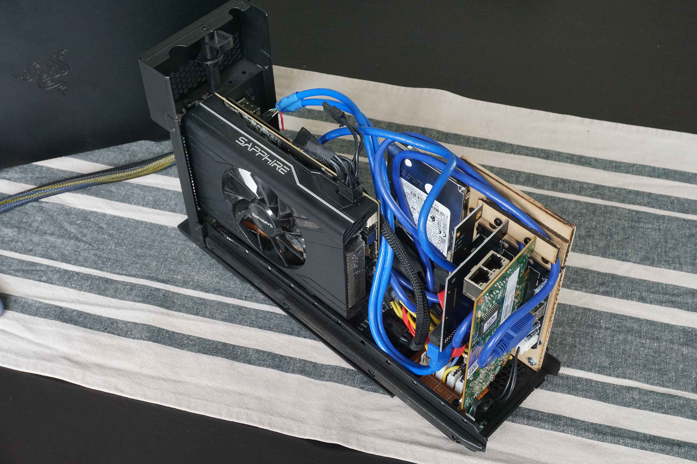

# Razer Core V2 Mod

## Intro

The goal of this project is to fit tree extra PCIe slots into the Razer Core V2. The original daugther board is replaced by custom PCIe backplanes.

In addition to a RX570 graphics card, tree extra PCIe low profile can be fitted in the case: a dual SATA controller, a dual Ethernet controller and a dual USB3.0 controller.

This project has been published on [egpu.io](https://egpu.io/forums/thunderbolt-enclosures/four-pcie-slots-into-the-razer-core-v2/).

Schematics can be found in `resources` folder.\
More images in `images` folder.

## Images

## Schematics

## Known issues

- USB ports are not perfectly aligned but still functional.
- Ethernet port is placed in the wrong way!
